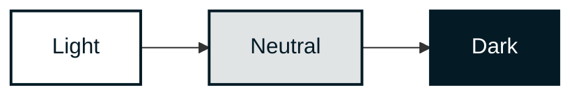
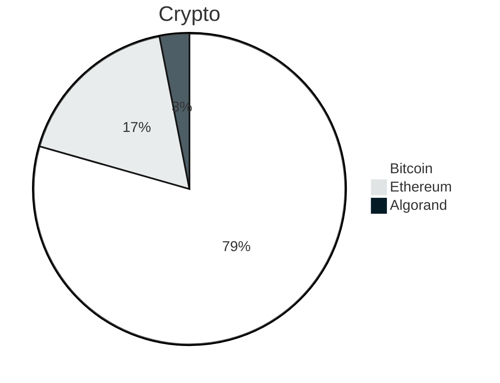

<div align="right">


</div>

##### BLOCK FOUNDATION

---

<div>
    
    <h1 align="left">Block Foundation</h1>
    <h3 align="left">Brand Assets & Visual Identity Guide</h3>
</div>

---


<br>

<details open="open">
<summary>Table of Contents</summary>
  
- [Style Guide](#style-guide)
- [Logo](#logo)
- [Typography](#typography)
- [Color](#color)
- [Graphics](#graphics)
- [Diagrams](#diagrams)
- [Elements](#elements)
- [Frameworks](#frameworks)
- [Templates](#templates)
- [Syntax](#syntax)
- [Colophon](#colophon)

</details>

<br clear="both"/>

---

<div align="right">


</div>

**Welcome to the official Brand Repository of the Block Foundation – Let's together uphold and amplify the voice of change in the world of architecture!**

## Introduction

This repository is an all-inclusive resource of our brand identity, encapsulating our ethos, vision, and the graphical elements that distinguish us in the global arena of architectural innovation.

Our brand is not just a logo or a name, but a reflection of our mission to revolutionize architecture through blockchain technology. It symbolizes our commitment to facilitating a sustainable, equitable, and dynamic housing market that balances the interests of all stakeholders.

This repository hosts a comprehensive collection of our branding materials — from our logo in various formats to color palettes, typography guidelines, official stationary templates, and presentation layouts. Each element is meticulously designed to communicate our essence, ensuring a cohesive and consistent representation of the Block Foundation across all platforms.

We invite our community, collaborators, and media personnel to use this repository as a guide when representing the Block Foundation. Whether you're creating content for us, collaborating on a project, or featuring our work, these resources will ensure you accurately capture and convey the spirit of our organization.

We kindly ask that you adhere to the guidelines detailed in this repository to maintain the integrity of our brand. And remember, our brand is not just an identifier but a promise of the transformative potential blockchain holds for the architectural landscape.

## Style Guide

<!-- Please see this PDF overview. -->

`Will be provided shortly.`

## Logo

[(Back to top)](#table-of-contents)

### Logomark

| Variant     | PNG   | SVG   | WEBP  | JPG   |
| :---------- | ----- | ----- | ----- | ----- |
| **dark** | [](https://github.com/block-foundation/brand/blob/master/src/logo/logo_dark.png) | [](https://github.com/block-foundation/brand/blob/master/src/logo/logo_dark.svg) | [](https://github.com/block-foundation/brand/blob/master/src/logo/logo_dark.webp) | [](https://github.com/block-foundation/brand/blob/master/src/logo/logo_dark.jpg) |
| **dark transparant** | [](https://github.com/block-foundation/brand/blob/master/src/logo/logo_dark-trans.png) | [](https://github.com/block-foundation/brand/blob/master/src/logo/logo_dark-trans.svg) | [](https://github.com/block-foundation/brand/blob/master/src/logo/logo_dark-trans.webp) |   |
| **gray** | [](https://github.com/block-foundation/brand/blob/master/src/logo/logo_gray.png) | [](https://github.com/block-foundation/brand/blob/master/src/logo/logo_gray.svg) | [](https://github.com/block-foundation/brand/blob/master/src/logo/logo_gray.webp) | [](https://github.com/block-foundation/brand/blob/master/src/logo/logo_gray.jpg) |
| **gray transparant** | [](https://github.com/block-foundation/brand/blob/master/src/logo/logo_gray-trans.png) | [](https://github.com/block-foundation/brand/blob/master/src/logo/logo_gray-trans.svg) | [](https://github.com/block-foundation/brand/blob/master/src/logo/logo_gray-trans.webp) | [](https://github.com/block-foundation/brand/blob/master/src/logo/logo_gray-trans.jpg) |
| **light** | [](https://github.com/block-foundation/brand/blob/master/src/logo/logo_light.png) | [](https://github.com/block-foundation/brand/blob/master/src/logo/logo_light.svg) | [](https://github.com/block-foundation/brand/blob/master/src/logo/logo_light.webp) | [](https://github.com/block-foundation/brand/blob/master/src/logo/logo_light.jpg) |
| **light transparant** | [](https://github.com/block-foundation/brand/blob/master/src/logo/logo_light-trans.png) | [](https://github.com/block-foundation/brand/blob/master/src/logo/logo_light-trans.svg) | [](https://github.com/block-foundation/brand/blob/master/src/logo/logo_light-trans.webp) |   |

### Logotype

`Will be provided shortly.`

<!-- |   |   |
| - | - |
|   |   | -->

### Favicon


### Badge

Share that your organisation or project endorses the Block Foundation by adding our badge to your readme or website.

`Will be provided shortly.`

<!-- ``` html
<a href="https://github.com/storybooks/storybook" target="_blank"></a>
``` -->

### ASCII Art

``` txt
# .............................................................................
# .............................................................................
# ....................................@@@......................................
# ................................@@@@@@@@@@@..................................
# ............................@@@@@@..@@@..@@@@@@..............................
# ........................@@@@@@......@@@......@@@@@@..........................
# ...................@@@@@@...........@@@..........,@@@@@@.....................
# ...............@@@@@@...............@@@...............@@@@@@.................
# ...........@@@@@@...................@@@...................@@@@@@.............
# .........@@@@@@.....................@@@.....................@@@@@@...........
# .........@@@.@@@@@@.................@@@.................@@@@@@.@@@...........
# .........@@@.....@@@@@@.............@@@.............@@@@@@.....@@@...........
# .........@@@.........@@@@@@@........@@@........@@@@@@%.........@@@...........
# .........@@@..............@@@@@@....@@@....@@@@@@..............@@@...........
# .........@@@..................@@@@@@@@@@@@@@@..................@@@...........
# .........@@@......................@@@@@@@......................@@@...........
# .........@@@........................@@@........................@@@...........
# .........@@@........................@@@........................@@@...........
# .........@@@........................@@@........................@@@...........
# .........@@@........................@@@........................@@@...........
# .........@@@........................@@@........................@@@...........
# .........@@@@.......................@@@.......................@@@@...........
# ...........@@@@@@...................@@@...................@@@@@@.............
# ...............@@@@@@...............@@@...............@@@@@@.................
# ...................@@@@@@...........@@@...........@@@@@@.....................
# ........................@@@@@@......@@@......@@@@@@..........................
# ............................@@@@@@..@@@..@@@@@@..............................
# ................................@@@@@@@@@@@..................................
# ....................................@@@......................................
# .............................................................................
# .............................................................................
```

``` txt
........................................................................
..................@.................                                   .
...............@@@@@@@..............      BLOCK FOUNDATION             .
...........@@@....@....@@@..........                                   .
.......@@@........@........@@@......      www.blockfoundation.io       .
......@@@@........@........@@@@.....      info@blockfoundation.io      .
......@.....@@@...@...@@@.....@.....                                   .
......@.........@@@@@.........@.....                                   .
......@...........@...........@.....                                   .
......@...........@...........@.....                                   .
......@...........@...........@.....                                   .
.........@@@......@......@@@........                                   .
.............@@@..@..@@@............                                   .
..................@.................                                   .
........................................................................
```

## Typography


### Main Display Font

We us `Barlow`.

<p align="center">
    
</p>

- Creators: [Jeremy Tribby](https://github.com/jpt) (Principal Design) and Nguyễn Hồng Nhung (Vietnamese)
- Repository: [jpt/barlow](https://github.com/jpt/barlow)
- License: [OFL](https://github.com/jpt/barlow/blob/main/OFL.txt)
- GIF courtesy of the original creators.

### Secondary Font

`Will be provided shortly.`

### Text Conventions

#### Brand Name

Capitalize the "B" and "F" in "Block Foundation" in all copy text. The Block Foundation should only be presented in all uppercase when displayed in our official logos; e.g.: "BLOCK FOUNDATION". In code, "block_foundation" is all lowercase / snakecase.

- ✓ BLOCK FOUNDATION `(in Logo)`
- ✓ Block Foundation `(in Text)`
- ✓ block_foundation `(in Code)`
- × BlockFoundation
- × blockFoundation
- × Block-Foundation
- × block-foundation
- × block foundation

#### Headers

All headers are written in Title Case.

#### Emoji's

We don't use them, ever.


## Color

### Base Colors

|           | Color     | HEX       | RGB       | HSL       | HSB       | CMYK      |
| --------- | --------- | --------- | --------- | --------- | --------- | --------- |
|  | **Base 01** | `#041B26` | `4, 27, 38` | `199, 81%, 8%` | `200, 90, 15` | `13%, 4%, 0%, 85%` |
|  | **Base 02** | `#E1E4E5` | `225, 228, 229` | `195, 7%, 89%` | `200, 2, 90` | `2%, 0%, 0%, 10%` |
|  | **Base 03** | `#F0F1F2` | `240, 241, 242` | `210, 7%, 95%` | `200, 1, 95` | `1%, 0%, 0%, 5%` |
|  | **Base 04** | `#FFFFFF` | `255, 255, 255` | `0, 0%, 100%` | `0, 0, 0` | `0%, 0%, 0%, 0%` |


### Secondary Colors

`Will be provided shortly.`

## Graphics

### Artworks

Our repositories use the following artworks to make them just a little bit moe enticing!

| Color | Monochrome | Acccent |
| ----- | ---------- | ------- |
| [](https://github.com/block-foundation/brand/master/src/image/repository_cover/block_foundation-structure-03-color.jpg)*`structure-03-color`* | [](https://github.com/block-foundation/brand/master/src/image/repository_cover/block_foundation-structure-03-mono.jpg)*`structure-03-mono`* | [](https://github.com/block-foundation/brand/master/src/image/repository_cover/block_foundation-structure-03-accent.jpg)*`structure-03-accent`* |

### Photography

`Will be provided shortly.`

### Banners

`Will be provided shortly.`

## Diagrams

We use [Mermaid](https://mermaid.js.org/) in our repositories for simple data and process visualisations. Some examples:

### Flowchart



`class_light`

``` md
classDef class_light fill:#FFFFFF,color:#041B26,stroke:#041B26,stroke-width:2px;
```

`class_neutral`

``` md
classDef class_neutral fill:#E1E4E5,color:#041B26,stroke:#041B26,stroke-width:2px;
```

`class_dark`

``` md
classDef class_dark fill:#041B26,color:#FFFFFF,stroke:#041B26,stroke-width:2px;
```

### Pie chart



``` md
%%{init: {"theme": "base", "pie": {"textPosition": 0.5}, "themeVariables": { "pieOuterStrokeWidth": "2px", "pie1": "#FFFFFF", "pie2": "#E1E4E5", "pie3": "#041B26"}}}%%
```

## Elements

### Icons

Within our repositories we use simple-icons for most iconographic purposes. This brand repository includes a copy this icon set (downloaded per 2023-07-25): [/src/icons/simple-icons/](/src/icons/simple-icons/)

- simple-icons website: [simpleicons.org](https://simpleicons.org/)
- simple-icons reposiory: [github.com/simple-icons/simple-icons](https://github.com/simple-icons/simple-icons)
- simple-icons license: [CC0 1.0 Universal](https://github.com/simple-icons/simple-icons/blob/develop/LICENSE.md)

### IO Shields

We use [IO Shields](https://shields.io/) combined with [simple-icons](https://simpleicons.org/) to display repository information.

#### Parameters

| Field           | Value           | Description |
| :-------------- | :-------------- | :---------- |
| style           | `flat-square`    |             |
| logo            | `bitcoin`       | Named logo via [simple-icons](https://simpleicons.org/) |
| logoColor       | `#FFFFFF`       | All white logo to match the text color |
| label           | `License:`      | Title caps label text |
| labelColor      | `#041B26`       | Completely dark background   |
| color           | `#041B26`       |  |
| cacheSeconds    | default         |  |
| link            | misc.           | Always try to provide a link |

#### Shields

|                     |      | shield.io url   | simpleicons tag   |
| :------------------ | :--- | :--- | :--- |
| **License**         |  | [/badges/git-hub](https://shields.io/badges/git-hub) | `readthedocs` |
| **Docker Pulls**    |  | [/badges/docker-pulls](https://shields.io/badges/docker-stars) | `docker` |
| **Docker Stars**    |  | [/badges/docker-stars](https://shields.io/badges/docker-stars) | `docker` |
| **Docker Version**    |  | [/badges/docker-stars](https://shields.io/badges/docker-stars) | `docker` |
| **Docker Size**     |  | [/badges/docker-image-size-tag](https://shields.io/badges/docker-image-size-tag) | `docker` |
| **devContainer**    |     | [/badges](https://shields.io/badges)    | `visualstudiocode` |
| **DOI**    |     | [/badges](https://shields.io/badges)    | `DOI` |
| **Zotero**    |     | [/badges](https://shields.io/badges)    | `Zotero` |
| **Download**    |   | [/badges](https://shields.io/badges)    | `files` |

#### Repository Headers

All repositories include the basic header, in some cases combined with additional shields.

##### Basic Repository Header

<div align="right">


</div>

##### Basic Repository Interactions

<div align="right">


</div>

##### Docker Container Repository Header

<div align="right">


</div>

##### LaTeX / Citation Repository Header

<div align="right">


</div>

##### TypeScript / NPM Repository Header

<div align="right">


</div>

##### Python / PyPi Repository Header

<div align="right">


</div>

## Frameworks

### SCSS

We use the [Stylescape SCSS Framework](https://github.com/scape-agency/stylescape) developed by [Scape Agency](https://www.scape.agency)&reg; for all our online content.

- Website: [scape.style](https://www.scape.style)
- Repository: [github.com/scape-agency/stylescape](https://github.com/scape-agency/stylescape)

#### HTML Script Tag

``` html
<script src="https://unpkg.com/stylescape@latest/dist.min.js"></script>
```

#### NPM Module

``` bash
npm i stylescape
```

## Templates

### Presentation Template

`Will be provided shortly.`

<!-- Share Block Foundation at work, meetups, and conferences. Get a head start on your slides with our ready-to-use presentation (Keynote, PDF).

This presentation template gives you a head start on presenting Block Foundation. It's inspired by how the community-at-large shares Block Foundation.

Please use, remix, and customize it to fit your needs. -->

#### Contents

- PDF
- Keynote
- PowerPoint

#### Customize

1. Requires Keynote to edit
2. Install the fonts here
3. Replace the for-placement-only images by dragging new images onto them
4. Fill out your name, Twitter, and other details as you see fit.
5. Create new slides to fit your talk

### Figma Template

For those who use [Figma](www.figma.com), we have included a template that can be used to create a new project. This template has Color Presets and some of the most common components.

Duplicate the template and rename it to your project name.

`Will be provided shortly.`

<!-- [GET TEMPLATE](https://www.figma.com/file/6h1AgZe3I5lYmD3mxu9cjR/Ballerini-Style-Guide/duplicate) -->

### HTML Email Signature Templates

Always in plain simple `text`.

``` txt
□     BLOCK FOUNDATION

      Lars van Vianen
      lars@blockfoundation.io

      www.blockfoundation.io
      info@blockfoundation.io
```

`Will be provided shortly.`

## Syntax

| Language            | Convention |
| :------------------ | :--------- |
| `Go`                | [Google Go Style Guide](https://github.com/google/styleguide/tree/gh-pages/go) |
| `Go`                | [Uber Go Style Guide](https://github.com/uber-go/guide) |
| `JavaScript`        | [Airbnb JavaScript Style Guide](https://github.com/airbnb/javascript) |
| `JavaScript`        | [Google JavaScript Style Guide](https://google.github.io/styleguide/jsguide.html) |
| `Python`            | [Google Python Style Guide](https://google.github.io/styleguide/pyguide.html) |
| `TypeScript`        | [Google TypeScript Style Guide](https://google.github.io/styleguide/tsguide.html) |

---

## Colophon

### Development Resources

#### Version

This documentation is in version `v0.0.1`.
Last edited: `07/2023`

<!-- #### Versions

The repository provides a track of different versions of the assets for easier navigation and understanding of the evolution of the brand. Each version is tagged with a unique identifier.

1.0.0 Initial release of brand assets
1.0.1 Minor tweaks to the color palette
1.1.0 Introduction of new logo variants
1.1.1 Fixes to SVG assets
1.2.0 Update of Typography guidelines
1.2.1 Minor fixes to the logo files
1.3.0 Addition of new graphics and diagrams
1.3.1 Updated Readme
1.4.0 Introduction of new Templates
1.4.1 Updated copyrights and licensing information -->

<!-- #### Branches

- `Master` Stable, production-ready version of the brand assets
- `Develop` Work in progress, latest changes and updates -->

#### Authors

This is an open-source project by the **[Block Foundation](https://www.blockfoundation.io "Block Foundation website")**.

The Block Foundation mission is enabling architects to take back initiative and contribute in solving the mismatch in housing through blockchain technology. Therefore the Block Foundation seeks to unschackle the traditional constraints and construct middle ground between rent and the rigidity of traditional mortgages.

website: [www.blockfoundation.io](https://www.blockfoundation.io "Block Foundation website")

<!-- #### Contributors

We are proud to acknowledge the contributions made by individuals from around the world. The success of this repository is a result of the collaborative efforts of these passionate individuals. -->

<!-- Contributions
Contributions to this project follow the all-contributors specification. Each contributor gets recognition for their work in the contributors section. -->
<!-- Pull Requests
Pull requests are always welcome. If you wish to contribute or make changes, please make a pull request. If it's a substantial change, please create an issue first, to discuss it. -->

<!-- Community
Join our community and contribute towards the development and enhancement of the brand assets. We value all our contributors and aim to create a vibrant community that supports and helps each other. -->

#### Contributing

We'd love for you to contribute and to make this project even better than it is today!
Please refer to the [contribution guidelines](.github/CONTRIBUTING.md) for information.

<!-- 
#### Sponsorships

Your sponsorships help us maintain this project. You can sponsor this project through the sponsorship link provided. Your contribution can help us in many ways, from keeping our servers up and running, to supporting the further development and improvement of these assets.

Issues
In case you find any errors or have suggestions for improvements, we encourage you to raise an issue. The Issues tab is a space for community members to discuss problems they’ve encountered, suggest enhancements, and more.


#### FAQ
We have compiled a list of frequently asked questions for easier navigation and understanding of this repository. If you have more questions, please raise an issue and we will be glad to assist you. -->

### Legal Information

#### Copyright

Copyright &copy; 2023 [Stichting Block Foundation](https://www.blockfoundation.io/ "Block Foundation website"). All Rights Reserved.

#### License

Except as otherwise noted, the content in this repository is licensed under the
[Creative Commons Attribution 4.0 International (CC BY 4.0) License](https://creativecommons.org/licenses/by/4.0/), and
code samples are licensed under the [Apache 2.0 License](http://www.apache.org/licenses/LICENSE-2.0).

Also see [LICENSE](https://github.com/block-foundation/community/blob/master/src/LICENSE) and [LICENSE-CODE](https://github.com/block-foundation/community/blob/master/src/LICENSE-CODE).

#### Disclaimer

**THIS SOFTWARE IS PROVIDED AS IS WITHOUT WARRANTY OF ANY KIND, EITHER EXPRESS OR IMPLIED, INCLUDING ANY IMPLIED WARRANTIES OF FITNESS FOR A PARTICULAR PURPOSE, MERCHANTABILITY, OR NON-INFRINGEMENT.**
